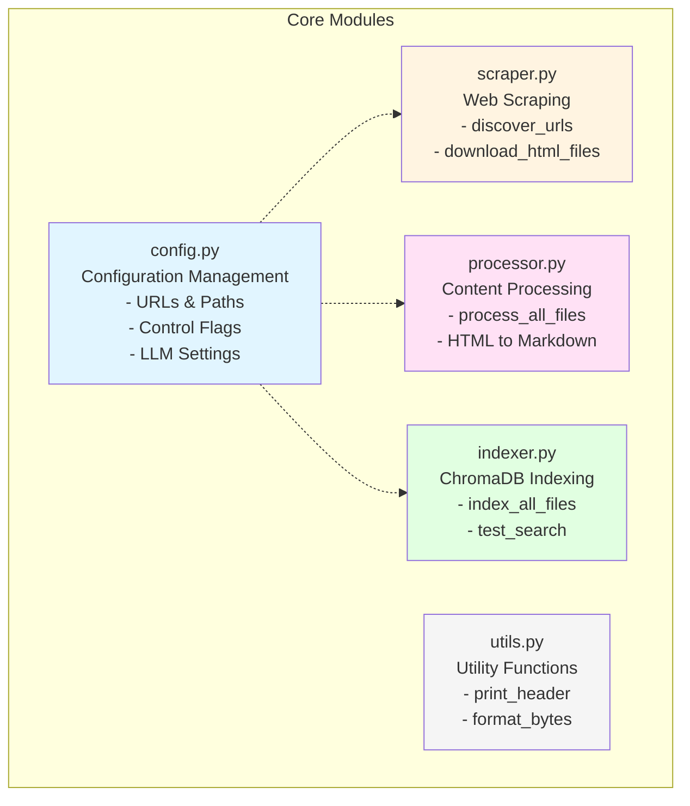
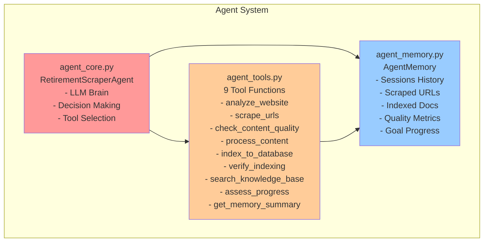
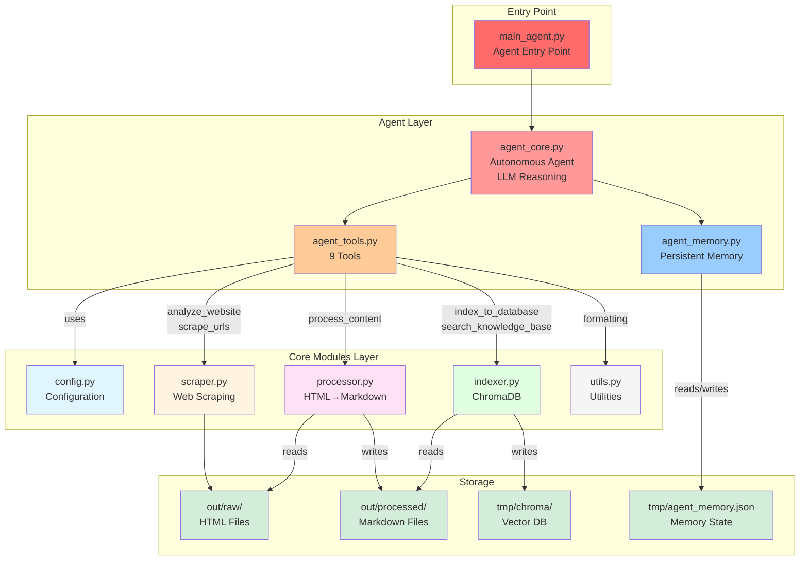

# System Architecture Diagrams

This document contains the visual architecture diagrams for the IRS Retirement Topics Autonomous Agent system.

## 📦 Modules Layer

The core modules that provide the foundational functionality:

## 🤖 Agent Layer

The autonomous agent components that provide reasoning and decision-making:

## 🔄 Complete System Orchestration

How the agent layer orchestrates the core modules to accomplish its goal:

## 📝 Component Descriptions

### Entry Point
- **main_agent.py**: Initializes the agent, loads memory, displays current state, and starts autonomous execution

### Agent Layer
- **agent_core.py**: The LLM-powered brain that reasons, plans, and makes decisions
- **agent_tools.py**: 9 capabilities the agent can choose to use based on its plan
- **agent_memory.py**: Persistent memory system that tracks all past actions and progress

### Core Modules Layer
- **config.py**: Centralized configuration (URLs, paths, flags, LLM settings)
- **scraper.py**: Web scraping functionality (URL discovery and HTML downloading)
- **processor.py**: AI-powered HTML to markdown conversion
- **indexer.py**: ChromaDB vector database operations (indexing and searching)
- **utils.py**: Common utility functions for display and formatting

### Storage Layer
- **out/raw/**: Downloaded HTML files with JSON metadata
- **out/processed/**: Clean markdown files extracted from HTML
- **tmp/chroma/**: ChromaDB vector database for semantic search
- **tmp/agent_memory.json**: Agent's persistent memory state

## 🔁 Data Flow

1. **main_agent.py** starts the agent
2. **Agent** (agent_core.py) loads its **Memory** (agent_memory.py)
3. **Agent** selects appropriate **Tools** (agent_tools.py) based on reasoning
4. **Tools** use **Core Modules** (scraper, processor, indexer) to perform work
5. **Core Modules** read/write to **Storage** (HTML, Markdown, ChromaDB)
6. **Agent** updates **Memory** with results and continues until goal achieved
